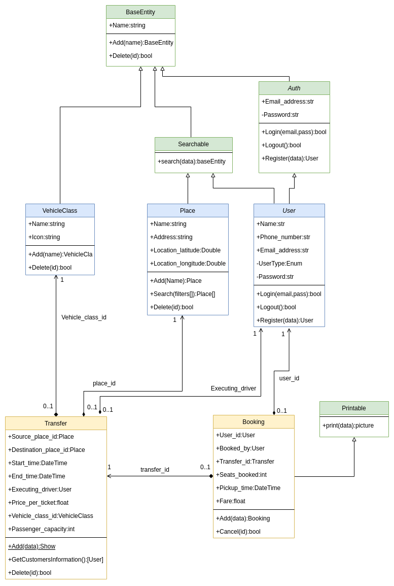

This project implements a simple PHP-backed application for searching for travel and booking a ticket for a customer. 

* The application architecture is MVC and implemented with PHP pure (without framework).
* The front-end application used Vue.js to implement the customer panel and require.js to manage JavaScript library loading in the browser.
* The database is MySQL, and the relationships between the tables are defined.
* The ORM is a simple PHP file that any other SQL-compatible database can replace by implementing a database interface. DB providers use a strategy pattern to switch between database drivers.
* The event-driven architecture is implemented with the RabbitMQ driver.
* You could see simple events and consumers in the code base.
* Security is so simple and powered by JWT tokens that can be kept for 1 hour each.
* The router is implemented with an elementary PHP class.
* The application used Docker Compose to run all components. 
* The integration tests are implemented by using the PHPUnit library. 


## Table of Contents
- [Class Diagram](#class-diagram)
- [Setup environment](#setup-environment)
- [Build backend](#build-backend)
- [Build frontend](#build-frontend)
- [Run Tests](#tests)
- [Run Rabbitmq consumer](#rabbitmq-consumer)

### Class Diagram
<p align="center"></p>

### Setup environment

we could run environment with 
	
```sh
docker-compose up
``` 

### Build backend
build data base tables and default data : 

```sh
docker-cmpose exec app sh 
composer i
php cli.php
 
```
and select "7. Init DB(essential at first time running )" from menu


### Build frontend
build front end application  : 

```sh
docker-cmpose exec front sh 
npm i
npm run prod
 
```

now you can open the "http://127.0.0.1:4000/" url in your browser and test app

### Tests
run tests: 

```sh
php vendor/bin/phpunit  --testdox  tests/ 
```

### Rabbitmq consumer

run rabbitmq consumer for email : 
```sh
docker-cmpose exec app sh 
php src/Consumers/Mail.php
 
```
